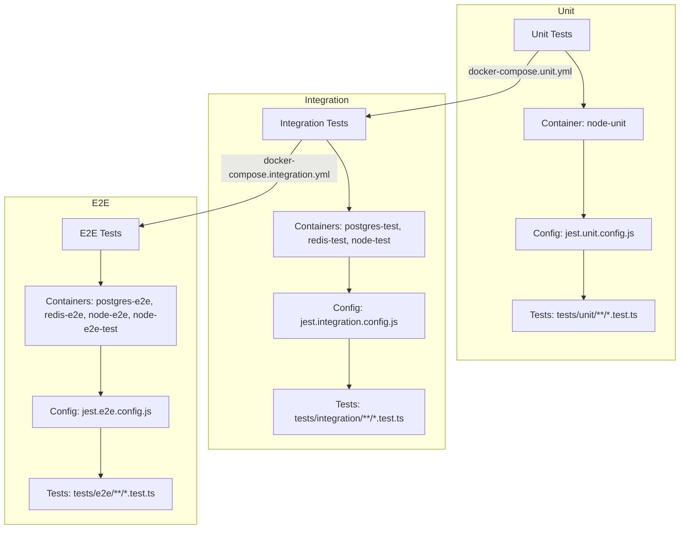
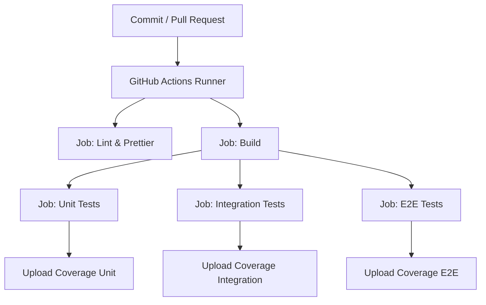

## Testes end-to-end no frontend

Este projeto demonstra como estruturar e executar testes end-to-end (E2E) no frontend com Playwright, Docker e CI/CD no GitHub Actions.
A aplicação é composta por Node.js/Express no backend e React + Vite no frontend, integrados a PostgreSQL e Redis.


--- 

### 🎯 O que são Testes E2E?

Testes end-to-end simulam o comportamento real do usuário, validando fluxos completos da aplicação, como:
- Registrar um novo usuário;
- Fazer login e navegar até o dashboard;
- Alterar a senha e manter a sessão válida;
- Tratar erros de autenticação (ex.: token inválido ou expirado);
- Enquanto testes unitários validam funções isoladas e testes de integração verificam módulos combinados, os E2E garantem que tudo funciona junto — frontend + backend + banco + cache.


---

### 🚀 Tecnologias Utilizadas

- Playwright – framework de testes E2E
- Page Object Pattern (POP) – abstração para interações estáveis com a UI
- React + Vite – frontend
- Node.js + Express – backend
- PostgreSQL – persistência de dados
- Redis – blacklist de tokens JWT
- Nginx – servidor estático e proxy reverso /api → backend
- Docker & Docker Compose – isolamento de ambiente
- GitHub Actions – pipeline de CI/CD


---

### 📂 Estrutura de Pastas

```bash
app/
├── .github/
│   └── workflows/
│       └── ci.yml
│
├── db/                     
│   └── init.sql 
│
├── front/  
│   ├── public/   
│   ├── src/
│   │   ├── api/
│   │   ├── components/
│   │   ├── contexts/
│   │   ├── layouts/
│   │   ├── pages/
│   │   ├── styles/
│   │   ├── types/
│   │   ├── App.tsx
│   │   └── main.tsx
│   ├── tests/
│   │   ├── e2e/
│   │   │   ├── changePassword.spec.ts
│   │   │   ├── dashboard.spec.ts
│   │   │   ├── login.spec.ts
│   │   │   └── register.spec.ts
│   │   └── pages/
│   │       ├── ChangePasswordPage.ts
│   │       ├── DashboardPage.ts
│   │       ├── LoginPage.ts
│   │       └── RegisterPage.ts
│   ├── Dockerfile.e2e.front   # Build front + stage de testes Playwright
│   ├── Dockerfile.production
│   ├── nginx.e2e.conf         # Proxy API → node-e2e-front
│   ├── nginx.production.conf  # Proxy para ambiente produtivo
│   ├── package.json
│   └── playwright.config.ts   # Configuração Playwright
│
├── server/  
│   ├── src/                     
│   │   ├── configs/             
│   │   ├── controllers/         
│   │   ├── middlewares/         
│   │   ├── routes/              
│   │   ├── types/               
│   │   ├── utils/               
│   │   └── index.ts             
│   ├── tests/                   
│   │   ├── e2e/
│   │   │   ├── api.e2e.test.ts
│   │   │   ├── infra.e2e.test.ts
│   │   │   └── user.e2e.test.ts 
│   │   ├── integration/
│   │   │   ├── controllers/         
│   │   │   │   └── user.controller.test.ts
│   │   │   └── helpers/            
│   │   ├── unit/
│   │   │   ├── controllers/ 
│   │   │   │   └── user.controller.test.ts
│   │   │   ├── middlewares/ 
│   │   │   │   ├── authMiddleware.test.ts
│   │   │   │   ├── errorHandler.test.ts
│   │   │   │   └── validateBody.test.ts
│   │   │   └── utils/ 
│   │   │       └── jwt.test.ts
│   │   │    
│   │   ├── jest.integration.setup.ts
│   │   └── jest.unit.setup.ts
│   │
│   ├── Dockerfile.e2e.front   # Usado por e2e da pasta front
│   ├── Dockerfile.e2e.server   # Usado por e2e da pasta server
│   ├── Dockerfile.integration
│   ├── Dockerfile.production
│   ├── Dockerfile.unit
│   ├── jest.integration.config.js
│   ├── jest.e2e.config.js
│   ├── jest.unit.config.js
│   └── package.json
│
├── .dockerignore
├── .env.e2e
├── .env.integration
├── .env.production
├── docker-compose.e2e-server.yml
├── docker-compose.integration.yml
├── docker-compose.production.yml
└── docker-compose.unit.yml

```


---

### ▶️ Execução Local


1. Clonar o repositório:

```bash
git clone https://github.com/arleysouza/e2e-front-test.git app
cd app
```

2. Subir containers para rodar a aplicação em modo de produção:
```bash
docker compose --env-file .env.production -f docker-compose.production.yml up --build -d
```
Encerrar e remover containers:
```bash
docker compose --env-file .env.production -f docker-compose.production.yml down -v
```
O arquivo `/http/requests.http` contém as requisições da aplicação (login, registro, logout, change password).
Para executá-las diretamente no VSCode, instale a extensão:
👉 REST Client (autor: Huachao Mao)
Após instalar, basta abrir o arquivo `requests.http`, clicar em `Send Request` sobre a requisição desejada, e o VSCode mostrará a resposta no editor.

**Testes end-to-end no front**
Os comandos a seguir permitem fazer os testes end-to-end no frontend com a aplicação rodando em modo de produção. Porém, essa não é uma prática recomendada por usar os bancos de dados da aplicação:
```bash
cd front
npm run test:e2e
```

4. Rodar testes unitários:
```bash
docker compose -f docker-compose.unit.yml up --build -d
```
Encerrar e remover containers:
```bash
docker compose -f docker-compose.unit.yml down -v
```


5. Rodar testes de integração:
```bash
docker compose --env-file .env.integration -f docker-compose.integration.yml up --build --abort-on-container-exit --exit-code-from node-integration-test
```
Os containers são finalizados após concluir os testes. 
Remover containers:
```bash
docker compose -f docker-compose.integration.yml down -v
```

6. Rodar testes end-to-end no servidor:
```bash
docker compose --env-file .env.e2e.server -f docker-compose.e2e-server.yml up --build --abort-on-container-exit --exit-code-from node-e2e-test
```
Os containers são finalizados após concluir os testes. 
Remover containers:
```bash
docker compose -f docker-compose.e2e-server.yml down -v
```

7. Rodar testes end-to-end no front:
```bash
docker compose --env-file .env.e2e.front -f docker-compose.e2e-front.yml up --build --abort-on-container-exit --exit-code-from front-e2e-test
```
Os containers são finalizados após concluir os testes. 
Remover containers:
```bash
docker compose -f docker-compose.e2e-front.yml down -v
```
**Observação**
- Os logs no terminal podem mostrar apenas parte da saída (ex.: *Running 11 tests…*).
- Para ver os resultados completos, use o Docker Desktop ou rode sem `-d` (modo attached).


--- 

### 🔑 Page Object Pattern (POPs)

Cada tela da aplicação possui uma classe em tests/pages/, que encapsula:
- Ações do usuário: `fillUsername()`, `submit()`, `logout()`;
- Validações: `expectError()`, `expectSuccess()`, `expectOnPage()`;
Isso garante testes mais limpos, reutilizáveis e estáveis.
Exemplo simplificado (`LoginPage`):
```ts
export class LoginPage {
  constructor(private page: Page) {}

  async goto() {
    await this.page.goto("/login");
  }

  async fillUsername(username: string) {
    await this.page.fill("[data-testid='login-username']", username);
  }

  async fillPassword(password: string) {
    await this.page.fill("[data-testid='login-password']", password);
  }

  async submit() {
    await this.page.click("[data-testid='login-submit']");
  }

  async expectError(message: string) {
    await expect(this.page.locator("[data-testid='login-error']")).toHaveText(message);
    await expect(this.page).toHaveURL(/.*login/);
  }
}
```


---

### ⚙️ Configurações do Nginx

`nginx.production.conf`
- Proxy `/api/` para `node-app:3000`
- Cache para assets estáticos
- Roteamento SPA (`try_files $uri /index.html`)

`nginx.e2e.conf`
- Mesmo proxy, mas apontando para `node-e2e-front:3000` (container de testes).
- Garante que os testes Playwright consigam usar `/api/*` sem precisar expor variáveis adicionais no frontend.

---

### ⚙️ Configuração do Playwright (playwright.config.ts)

- Define `baseURL` dinamicamente:
  - Local: `http://localhost:${FRONT_HOST_PORT}`
  - CI (Docker): `http://front-e2e-front:80`
- Roda sempre em headless mode no CI
- Habilita retries (2x) para maior resiliência
- Gera relatórios em HTML e line reporter

Exemplo:
```ts
import { defineConfig, devices } from "@playwright/test";
import * as dotenv from "dotenv";

dotenv.config();

const baseURL =
  process.env.CI === "true"
    ? "http://front-e2e-front:80"
    : `http://localhost:${process.env.FRONT_HOST_PORT || 3003}`;

export default defineConfig({
  testDir: "./tests/e2e",
  retries: 2,
  use: {
    baseURL,
    headless: true,
    trace: "on-first-retry",
    screenshot: "only-on-failure",
    video: "retain-on-failure",
  },
  projects: [{ name: "Chromium", use: { ...devices["Desktop Chrome"] } }],
});

```

### Fluxo de Execução dos Testes

Nosso projeto contém três camadas de testes: unit, integration e e2e. Cada uma possui responsabilidades, containers Docker e arquivos de configuração específicos.

#### 1. Testes unitários

Objetivo: validar funções isoladas, sem dependências externas.

- Compose: `docker-compose.unit.yml`
- Dockerfile: `server/Dockerfile.unit`
- Script executado: `npm run test:unit`
- Configuração Jest: `server/jest.unit.config.js`
- Setup Jest: `server/tests/jest.unit.setup.ts`
- Escopo dos testes: `server/tests/unit/**/*.test.ts`

Os testes rodam apenas dentro de um container Node.js (`node-unit`).
Como o objetivo é testar as funções isoladamente, os testes substituem as conexões com o Postgres e Redis por mocks.


#### 2. Testes de integração 

Objetivo: verificar se módulos diferentes funcionam corretamente em conjunto.

- Compose: `docker-compose.integration.yml`
- Dockerfile: `server/Dockerfile.integration`
- Script executado: `npm run test:ci`
- Configuração Jest: `server/jest.integration.config.js`
- Setup Jest: `server/tests/jest.integration.setup.ts`
- Escopo dos testes: `server/tests/integration/**/*.test.ts`

Containers envolvidos:
- `postgres-test`
- `redis-test`
- `node-test` (executa a suíte Jest)

Aqui usamos Postgres e Redis reais, mas o servidor Express é instanciado diretamente em memória (`via helpers/testApp.ts`) sem abrir uma porta HTTP.


#### 3. Testes end-to-end

Objetivo: simular o comportamento do usuário final em um fluxo completo do sistema.

- Compose: `docker-compose.e2e-server.yml`
- Dockerfile: `server/Dockerfile.e2e`
- Script executado: `npm run test:e2e`
- Configuração Jest: `server/jest.e2e.config.js`
- Setup Jest: `server/tests/jest.integration.setup.ts`
- Escopo dos testes: `server/tests/e2e/**/*.test.ts`

Containers envolvidos:
- `postgres-e2e`
- `redis-e2e`
- `node-e2e` (servidor Express rodando em http://node-e2e:3000)
- `node-e2e-test` (executa a suíte Jest, aguardando os serviços estarem prontos com wait-on)

A principal diferença em relação aos testes de integração é que aqui os testes fazem requisições HTTP reais contra o servidor rodando no container `node-e2e`.


#### 🔄 Diagrama do Fluxo de Testes




---

### 🚀 Execução no GitHub Actions

O pipeline definido em `.github/workflows/ci.yml` executa cinco jobs principais em paralelo/sequência:

1. **Lint & Prettier** – garante qualidade e formatação do código.
2. **Build** – compila o TypeScript.
3. **Unit Tests** – roda com `docker-compose.unit.yml`, usando apenas Node.js (sem Postgres/Redis).
4. **Integration Tests** – roda com `docker-compose.integration.yml`, usando Postgres e Redis efêmeros.
5. **E2E Tests** – roda com `docker-compose.e2e-server.yml`, simulando fluxos completos de negócio.

Cada etapa publica seu relatório de cobertura (`coverage/`) como artefato no GitHub Actions.


---

### 🔄 Fluxo de Execução do Pipeline



